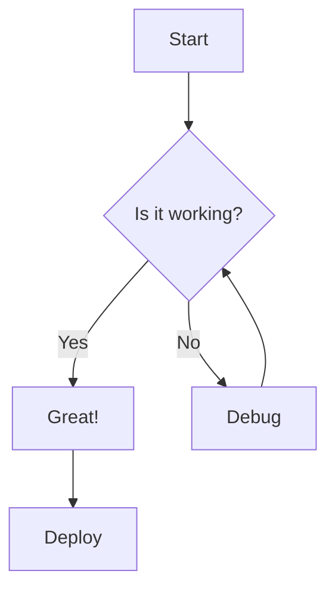
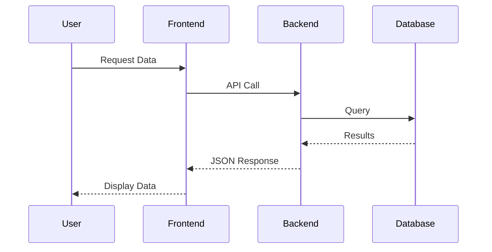

# Markdown Features Showcase

This article demonstrates all supported markdown features in this portfolio.

## Text Formatting

You can use **bold text**, *italic text*, and ***bold italic text***. You can also use ~~strikethrough~~ text.

## Code Blocks

Inline code: `const greeting = "Hello World";`

### Python Code with Syntax Highlighting

```python
def fibonacci(n):
    if n <= 1:
        return n
    return fibonacci(n-1) + fibonacci(n-2)

# Calculate first 10 fibonacci numbers
for i in range(10):
    print(f"F({i}) = {fibonacci(i)}")
```

### JavaScript Example

```javascript
const fetchData = async (url) => {
  try {
    const response = await fetch(url);
    const data = await response.json();
    return data;
  } catch (error) {
    console.error('Error fetching data:', error);
  }
};
```

### TypeScript Example

```typescript
interface User {
  id: number;
  name: string;
  email: string;
}

async function getUser(userId: number): Promise<User> {
  const response = await fetch(`/api/users/${userId}`);
  const user: User = await response.json();
  return user;
}
```

### C++ Example

```cpp
#include <iostream>
#include <vector>

class Calculator {
private:
    double result;
    
public:
    Calculator() : result(0.0) {}
    
    double add(double a, double b) {
        result = a + b;
        return result;
    }
    
    void display() {
        std::cout << "Result: " << result << std::endl;
    }
};

int main() {
    Calculator calc;
    calc.add(5.5, 3.2);
    calc.display();
    return 0;
}
```

### C Example

```c
#include <stdio.h>
#include <stdlib.h>

int* fibonacci(int n) {
    int* fib = (int*)malloc(n * sizeof(int));
    fib[0] = 0;
    fib[1] = 1;
    
    for(int i = 2; i < n; i++) {
        fib[i] = fib[i-1] + fib[i-2];
    }
    
    return fib;
}

int main() {
    int n = 10;
    int* result = fibonacci(n);
    
    for(int i = 0; i < n; i++) {
        printf("%d ", result[i]);
    }
    
    free(result);
    return 0;
}
```

## Tables

| Feature | Supported | Notes |
|---------|-----------|-------|
| Tables | ✅ | Full support with styling |
| Code Highlighting | ✅ | Multiple languages |
| Math Equations | ✅ | KaTeX/LaTeX support |
| Diagrams | ✅ | Mermaid support |
| Images | ✅ | Responsive images |

## Mathematical Equations (KaTeX)

Inline math: The quadratic formula is $x = \frac{-b \pm \sqrt{b^2-4ac}}{2a}$

Display math:

$$
E = mc^2
$$

$$
\int_{-\infty}^{\infty} e^{-x^2} dx = \sqrt{\pi}
$$

## Lists

### Unordered List
- First item
- Second item
  - Nested item 1
  - Nested item 2
- Third item

### Ordered List
1. First step
2. Second step
3. Third step

## Blockquotes

> "The only way to do great work is to love what you do."
> - Steve Jobs

## Links and Images

Check out my [GitHub profile](https://github.com/aliahadmd) for more projects.

## UML/Flowchart Diagrams (Mermaid)





## Horizontal Rule

---

## Conclusion

All major markdown features are now supported including:
- ✅ Syntax highlighting for code blocks
- ✅ Tables with styling
- ✅ KaTeX/LaTeX math equations
- ✅ Mermaid diagrams (flowcharts, sequence diagrams, etc.)
- ✅ Images with responsive sizing
- ✅ Lists, blockquotes, and text formatting
- ✅ Links and more!

